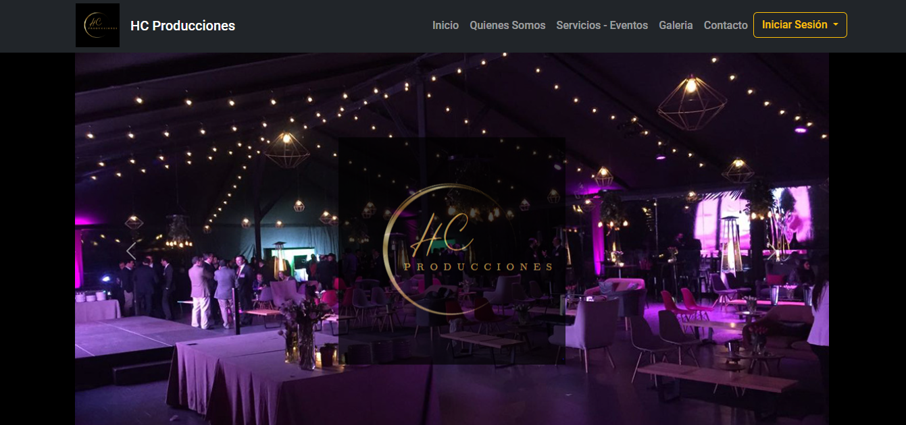
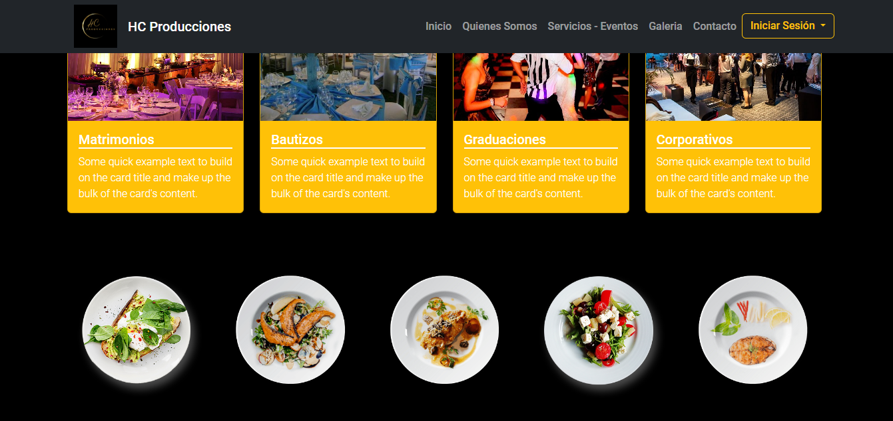
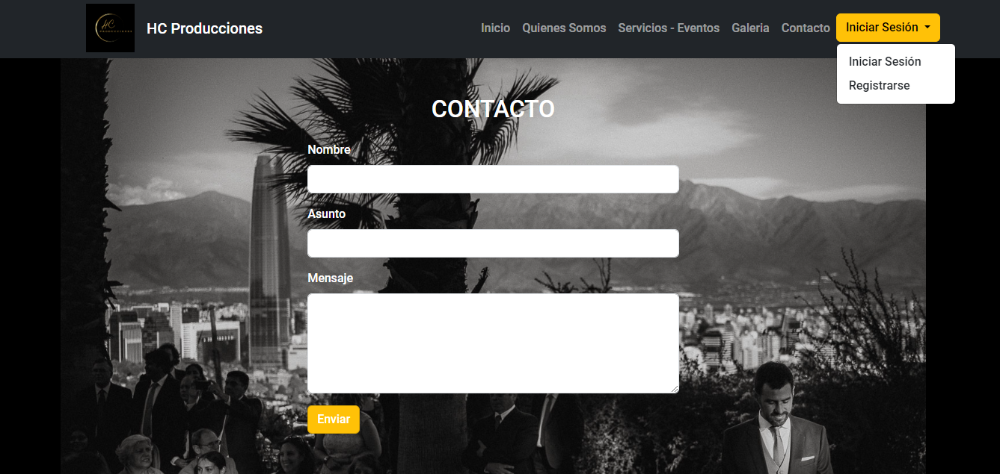

Proyecto académico DUOC-UC / Ingeniería del software & Desarrollo Web

Desarrollo de página web responsiva utilizando stack: Html, Js, bootstrap, jQuery, Ajax, Python/Django

Descripcion:
Pagina Web para productora de eventos

  
 
 

Derechos reservados de autoria:
Algunos materiales utilizados en esta publicación pertenecen a terceros y se utilizan con fines educativos. Se reconoce que no cuentat con los derechos de autor sobre este contenido y agradecemos a los respectivos propietarios por su contribución.
